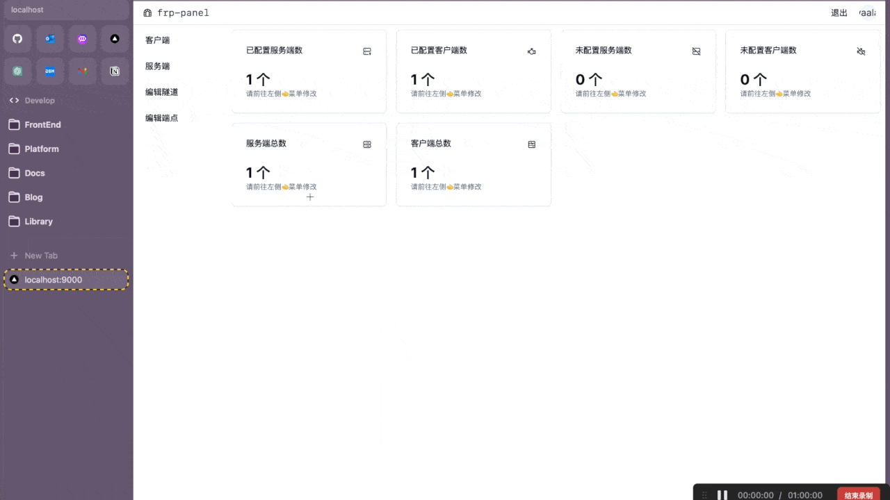
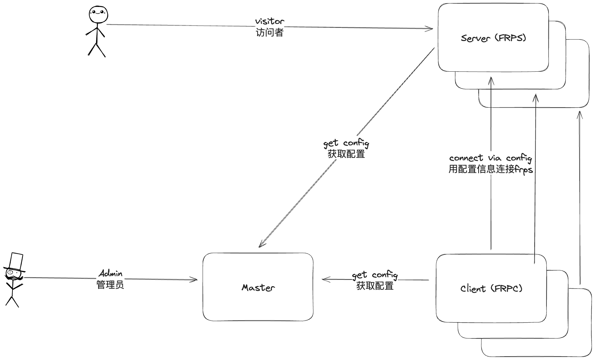

> 详细博客地址: [https://vaala.cat/2024/01/14/frp-panel-doc/](https://vaala.cat/2024/01/14/frp-panel-doc/)
> 使用说明可以看博客，也可以直接滑到最后

# FRP-Panel

我们的目标就是做一个：   
- 客户端配置可中心化管理   
- 多服务端配置管理   
- 可视化配置界面   
- 简化运行所需要的配置   
   
的更强更完善的frp！

- demo Video: [demo Video](doc/frp-panel-demo.mp4)



## 项目开发指南

### 平台架构设计   

技术栈选好了，下一步就是要设计程序的架构。在刚刚背景里说的那样，frp本身有frpc和frps（客户端和服务端），这两个角色肯定是必不可少了。然后我们还要新增一个东西去管理它们，所以frp-panel新增了一个master角色。master会负责管理各种frpc和frps，中心化的存储配置文件和连接信息。   

然后是frpc和frps。原版是需要在两边分别写配置文件的。那么既然原版已经支持了，就不用在走原版的路子，我们直接不支持配置文件，所有的配置都必须从master获取。   

其次还要考虑到与原版的兼容问题，frp-panel的客户端/服务端都必须要能连上官方frpc/frps服务。这样的话就可以做到配置文件/不要配置文件都能完美工作了。   
总的说来架构还是很简单的。



### 开发

项目包含三个角色   
1. Master: 控制节点，接受来自前端的请求并负责管理Client和Server   
2. Server: 服务端，受控制节点控制，负责对客户端提供服务，包含frps和rpc(用于连接Master)服务   
3. Client: 客户端，受控制节点控制，包含frpc和rpc(用于连接Master)服务   
   
接下来给出一个项目中各个包的功能   
```
.
|-- biz                 # 主要业务逻辑
|   |-- client          # 客户端逻辑（这里指的是frp-panel的客户端）
|   |-- master          # frp-panel 控制平面，负责处理前端请求，并且使用rpc管理frp-panel的server和client
|   |   |-- auth        # 认证模块，包含用户认证和客户端认证
|   |   |-- client      # 客户端模块，包含前端管理客户端的各种API
|   |   |-- server      # 服务端模块，包含前端管理服务端的各种API
|   |   `-- user        # 用户模块，包含用户管理、用户信息获取等
|   `-- server          # 服务端逻辑（这里指的是frp-panel的服务端）
|-- cache               # 缓存，用于存储frps的认证token
|-- cmd                 # 命令行入口，main函数的所在地，负责按需启动各个模块
|-- common
|-- conf
|-- dao                 # data access object，任何和数据库相关的操作会调用这个库
|-- doc                 # 文档
|-- idl                 # idl定义
|-- middleware          # api的中间件，包含JWT和context相关，用于处理api请求，鉴权通过后会把用户信息注入到context，可以通过common包获取
|-- models              # 数据库模型，用于定义数据库表。同时包含实体定义
|-- pb                  # protobuf生成的pb文件
|-- rpc                 # 各种rpc的所在地，包含Client/Server调用Master的逻辑，也包含Master使用Stream调用Client和Server的逻辑
|-- services            # 各种需要在内存中持久运行的模块，这个包可以管理各个服务的运行/停止
|   |-- api             # api服务，运行需要外部传入一个ginRouter
|   |-- client          # frp的客户端，即frpc，可以控制frpc的各种配置/开始与停止
|   |-- master          # master服务，包含rpc的服务端定义，接收到rpc请求后会调用biz包处理逻辑
|   |-- rpcclient       # 有状态的rpc客户端，因为rpc的client都没有公网ip，因此在rpc client启动时会调用master的stream长连接rpc，建立连接后Master和Client通过这个包通信
|   `-- server          # frp的服务端，即frps，可以控制frps的各种配置/开始与停止
|-- tunnel              # tunnel模块，用于管理tunnel，也就是管理frpc和frps服务
|-- utils
|-- watcher             # 定时运行的任务，比如每30秒更新一次配置文件
`-- www
    |-- api
    |-- components # 这里面有一个apitest组件用于测试
    |   `-- ui
    |-- lib
    |   `-- pb
    |-- pages
    |-- public
    |-- store
    |-- styles
    `-- types

```

### 调试启动方式：

- master: `go run cmd/*.go master`
- client: `go run cmd/*.go client -i <clientID> -s <clientSecret>`
- server: `go run cmd/*.go server -i <serverID> -s <serverSecret>`

项目配置文件会默认读取当前文件夹下的.env文件，项目内置了样例配置文件，可以按照自己的需求进行修改

详细架构调用图


## 项目使用说明
frp-panel可选docker和直接运行模式部署，直接部署请到release下载文件：[release](https://github.com/VaalaCat/frp-panel/releases)

### docker   

- master   
   
```
docker run -d -p 9000:9000 \
	-p 9001:9001 \
	-v /opt/frp-panel:/data \
	-e APP_GLOBAL_SECRET=your_secret \ # Master的secret注意不要泄漏，客户端和服务端的是通过Master生成的
	-e MASTER_RPC_HOST=0.0.0.0 \
	vaalacat/frp-panel

```
- client   
   
```
docker run -d -p your_port:your_port \
	-e APP_GLOBAL_SECRET=your_secret \  # 客户端和服务端的Secret与Master不一样，但也最好不要泄漏
	-e MASTER_RPC_HOST=your_master \	# master节点的IP，端口是默认9000，修改配置请看最后
	vaalacat/frp-panel client -s xxx -i xxx # 在WebUI复制的参数
```
- server   
   
```
docker run -d -p your_port:your_port \
	-e APP_GLOBAL_SECRET=your_secret \  # 客户端和服务端的Secret与Master不一样，但也最好不要泄漏
	-e MASTER_RPC_HOST=your_master \	# master节点的IP，端口是默认9000，修改配置请看最后
	vaalacat/frp-panel server -s xxx -i xxx # 在WebUI复制的参数
```
直接运行   
- master   
   
```
APP_GLOBAL_SECRET=your_secret MASTER_RPC_HOST=0.0.0.0 frp-panel master
```
- client   
   
```
APP_GLOBAL_SECRET=your_secret MASTER_RPC_HOST=0.0.0.0 frp-panel client -s xxx -i xxx # 在WebUI复制的参数
```
- client   
   
```
APP_GLOBAL_SECRET=your_secret MASTER_RPC_HOST=0.0.0.0 frp-panel server -s xxx -i xxx # 在WebUI复制的参数
```
### 配置说明

[settings.go](conf/settings.go)
这里有详细的配置参数解释，需要进一步修改配置请参考该文件

### 一些图片


