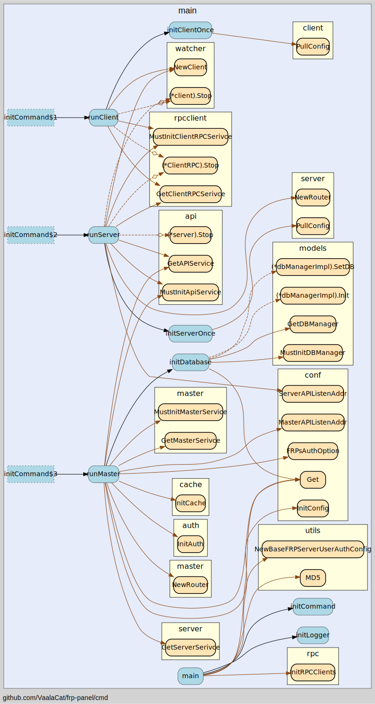

项目如下

项目包含三个角色
1. Master: 控制节点，接受来自前端的请求并负责管理Client和Server
2. Server: 服务端，受控制节点控制，负责对客户端提供服务，包含frps和rpc(用于连接Master)服务
3. Client: 客户端，受控制节点控制，包含frpc和rpc(用于连接Master)服务

启动方式：

- master: `go run cmd/*.go master` 或是 `frp-panel master`
- client: `go run cmd/*.go client -i <clientID> -s <clientSecret>` 或是 `frp-panel client -i <clientID> -s <clientSecret>`
- server: `go run cmd/*.go server -i <serverID> -s <serverSecret>` 或是 `frp-panel server -i <serverID> -s <serverSecret>`

项目配置文件会默认读取当前文件夹下的.env文件，项目内置了样例配置文件，可以按照自己的需求进行修改

```
.
|-- biz                 # 主要业务逻辑
|   |-- client          # 客户端逻辑（这里指的是frp-panel的客户端）
|   |-- master          # frp-panel 控制平面，负责处理前端请求，并且使用rpc管理frp-panel的server和client
|   |   |-- auth        # 认证模块，包含用户认证和客户端认证
|   |   |-- client      # 客户端模块，包含前端管理客户端的各种API
|   |   |-- server      # 服务端模块，包含前端管理服务端的各种API
|   |   `-- user        # 用户模块，包含用户管理、用户信息获取等
|   `-- server          # 服务端逻辑（这里指的是frp-panel的服务端）
|-- cache               # 缓存，用于存储frps的认证token
|-- cmd                 # 命令行入口，main函数的所在地，负责按需启动各个模块
|-- common
|-- conf
|-- dao                 # data access object，任何和数据库相关的操作会调用这个库
|-- doc                 # 文档
|-- idl                 # idl定义
|-- middleware          # api的中间件，包含JWT和context相关，用于处理api请求，鉴权通过后会把用户信息注入到context，可以通过common包获取
|-- models              # 数据库模型，用于定义数据库表。同时包含实体定义
|-- pb                  # protobuf生成的pb文件
|-- rpc                 # 各种rpc的所在地，包含Client/Server调用Master的逻辑，也包含Master使用Stream调用Client和Server的逻辑
|-- services            # 各种需要在内存中持久运行的模块，这个包可以管理各个服务的运行/停止
|   |-- api             # api服务，运行需要外部传入一个ginRouter
|   |-- client          # frp的客户端，即frpc，可以控制frpc的各种配置/开始与停止
|   |-- master          # master服务，包含rpc的服务端定义，接收到rpc请求后会调用biz包处理逻辑
|   |-- rpcclient       # 有状态的rpc客户端，因为rpc的client都没有公网ip，因此在rpc client启动时会调用master的stream长连接rpc，建立连接后Master和Client通过这个包通信
|   `-- server          # frp的服务端，即frps，可以控制frps的各种配置/开始与停止
|-- tunnel              # tunnel模块，用于管理tunnel，也就是管理frpc和frps服务
|-- utils
|-- watcher             # 定时运行的任务，比如每30秒更新一次配置文件
`-- www
    |-- api
    |-- components # 这里面有一个apitest组件用于测试
    |   `-- ui
    |-- lib
    |   `-- pb
    |-- pages
    |-- public
    |-- store
    |-- styles
    `-- types
```

详细架构调用图

